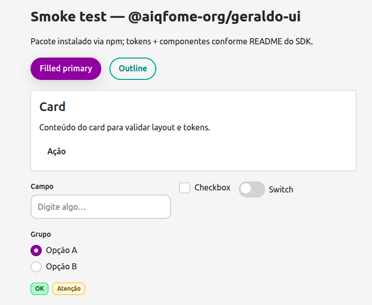

# Aiqfome SDK (`@aiqfome-sdk`)

Monorepositório de **pacotes escopados** usando **pnpm workspace**, que auxilia o desenvolvimento de produtos seguindo o styleguide do `geraldo` no aiqfome.

## Pacotes

| Package                                      | Role                                                                 |
| -------------------------------------------- | -------------------------------------------------------------------- |
| [`@aiqfome-sdk/themes`](packages/themes)     | Tokens seguindo o styleguide do aiqfome para uso nos demais pacotes. |
| [`@aiqfome-sdk/ui-lit`](packages/ui-lit)     | SDK de **Web Components** (Lit + TypeScript)                         |
| [`@aiqfome-sdk/ui-react`](packages/ui-react) | Componentes usando Lit diretamente no react                          |



## Requisitos

- Node 24+

## Instalação

```bash
# Para web components
npm install @aiqfome-sdk/ui-lit @aiqfome-sdk/themes

# Para react
npm install @aiqfome-sdk/ui-react @aiqfome-sdk/themes
```

## Uso rápido - Web Components - @aiqfome-sdk/ui-lit

1. Importe os **tokens** (CSS variables) uma vez na raiz do app (antes de qualquer componente).
2. Importe o bundle JS para **registrar** os custom elements.

```ts
// Inicializa as folhas de estilo do aiqfome
import "@aiqfome-sdk/themes/tokens.css";
```

E utilize no seu HTML ou React:

```html
<geraldo-button variant="filled" color="primary">Salvar</geraldo-button>
<geraldo-text variant="h3-section" weight="medium">Seção</geraldo-text>
```

### Registro dos custom elements

Os elementos **não** são registrados só por importar o pacote. Chame **uma vez** no browser antes de renderizar (idempotente):

```ts
import "@aiqfome-sdk/themes/tokens.css";
import { setupAiqfomeUI } from "@aiqfome-sdk/ui-lit";

setupAiqfomeUI();
```

## Uso rápido em React - @aiqfome-sdk/ui-react

Uma vez no seu `main.tsx` (tokens CSS + registro; `defineGeraldoUI` e `setupAiqfomeUI` fazem o mesmo):

```ts
import "@aiqfome-sdk/themes/tokens.css";
import { setupAiqfomeUI } from "@aiqfome-sdk/ui-react";

setupAiqfomeUI();
```

E Crie seu componente usando os pacotes:

```tsx
import { GeraldoButton } from "@aiqfome-sdk/ui-react";

export function MyReactComponentExample() {
  return (
    <GeraldoButton
      variant="outline"
      color="secondary"
      size="sm"
      onClick={() => {
        console.log("Hello!");
      }}
    >
      Say hello
    </GeraldoButton>
  );
}
```

Declare os tipos JSX se necessário (ou use `react-jsx` com `IntrinsicElements`).

## Ícones

O guia referencia [Material Symbols](https://fonts.google.com/icons) e [MDI](https://pictogrammers.com/library/mdi/). Este pacote **não** inclui ícones: use SVG no slot `icon` de `geraldo-button` / `geraldo-badge`, ou bibliotecas como `@mdi/js` no seu app.

## Tema escuro

Defina no ancestral (ex.: `<html data-geraldo-theme="dark">`) ou use a classe `.geraldo-theme-dark` no container. Tokens de superfície e seleção são ajustados em `geraldo-tokens.css`.

## Componentes exportados

| Tag                   | Descrição                                                                   |
| --------------------- | --------------------------------------------------------------------------- |
| `geraldo-button`      | CTA: `variant`, `color`, `size`, `loading`                                  |
| `geraldo-text`        | Tipografia: `variant`, `weight`, `as`                                       |
| `geraldo-badge`       | `tone` (primary, developer, …)                                              |
| `geraldo-card`        | `radius`, `elevation`; slots `header`, default, `footer`                    |
| `geraldo-text-field`  | `label`, `description`, `error`, eventos `geraldo-input` / `geraldo-change` |
| `geraldo-checkbox`    | `checked`, `disabled`; `geraldo-change`                                     |
| `geraldo-radio-group` | `value`, `name`, `legend`                                                   |
| `geraldo-radio`       | `value`, `checked`, `name`                                                  |
| `geraldo-switch`      | `checked`, `disabled`; `geraldo-change`                                     |

## App de exemplo (pedidos)

Listagem de pedidos em [examples/pedidos-app](examples/pedidos-app) usando **todos** os componentes do SDK. O Vite aponta `@aiqfome-sdk/ui-lit` para o código-fonte do repositório (alias), sem precisar publicar o pacote.

```bash
npm run example:pedidos
# ou: cd examples/pedidos-app && npm install && npm run dev
```

## Desenvolvimento

```bash
pnpm install
pnpm run build
pnpm run storybook

# Para executar os projetos de exemplo:
pnpm example:pedidos # web components
pnpm example:pedidos-react # react + web components
pnpm example:pedidos-react-tailwind # react + tailwind
```

O repositório usa **Gitflow**: integração em **`develop`**, releases estáveis em **`main`**. Detalhes (feature / release / hotfix) em [CONTRIBUTING.md](./CONTRIBUTING.md).

## Publicação no npm (mantenedores)

1. **Organização npm** — quem publica precisa ser membro da org [npmjs.com/org/aiqfome-org](https://www.npmjs.com/org/aiqfome-org) com permissão de publicação (ou criar a org em [npmjs.com/org/create](https://www.npmjs.com/org/create)).
2. **Login** — `npm login` (ou token de automação no CI; ver workflow em `.github/workflows/publish.yml`).
3. **Validar artefato** — `npm run build` e conferir `dist/index.js`, `dist/index.d.ts`, `dist/geraldo-tokens.css`; opcionalmente `npm pack --dry-run`.
4. **Versão** — `npm version patch|minor|major` (ou editar `version` em `package.json`) antes de publicar uma release nova.
5. **Publicar** — `npm publish`. O pacote usa `publishConfig.access: "public"`; não é obrigatório passar `--access public` manualmente.

Publicação automática: ao **publicar uma release** no GitHub, configure o secret `NPM_TOKEN` (token **Automation** da npm com permissão de publish no escopo `@aiqfome-org`) para o workflow publicar o pacote.

## Licença

MIT — ver [LICENSE](./LICENSE).
