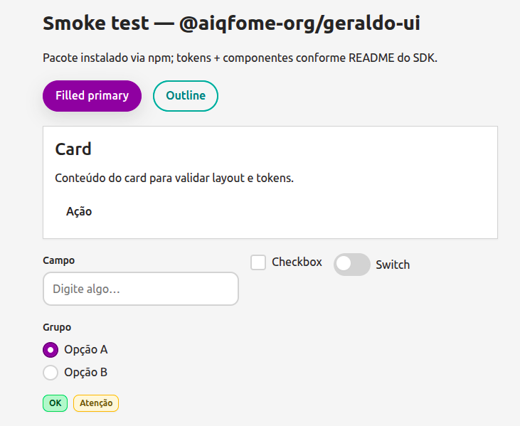

# Geraldo UI (`@aiqfome-org/geraldo-ui`)

[](https://www.npmjs.com/package/@aiqfome-org/geraldo-ui)
[](./LICENSE)

SDK de **Web Components** (Lit + TypeScript) com **tokens CSS** do guia **Geraldo**, para apps aiqfome (incluindo **Loja de APPs** no portal do lojista). O pacote é **ESM**, publicado no **npm** e consumível em qualquer stack web (React, Vue, Svelte, HTML estático).

| Recurso | Descrição |
| -------- | ----------- |
| **Design system** | Tags `geraldo-*` (botões, tipografia, cartões, formulário, etc.) |
| **Auth (opcional)** | Subpath `@aiqfome-org/geraldo-ui/auth` — Magalu ID + Geraldo (`postMessage`, popup OAuth `code`) |
| **Repositório** | [github.com/aiqfome/aiqfome-ui-sdk](https://github.com/aiqfome/aiqfome-ui-sdk) |



## Índice

1. [Requisitos](#requisitos)
2. [Instalação e entrypoints](#instalação-e-entrypoints)
4. [Autenticação Magalu e Geraldo](#autenticação-magalu-e-geraldo)
5. [Uso rápido (design system)](#uso-rápido-design-system)
6. [Registro dos custom elements](#registro-dos-custom-elements)
7. [Ícones](#ícones)
8. [Tema escuro](#tema-escuro)
9. [Componentes exportados](#componentes-exportados)
10. [Exemplos no repositório](#exemplos-no-repositório)
11. [Desenvolvimento e Storybook](#desenvolvimento-e-storybook)
12. [Publicação no npm (mantenedores)](#publicação-no-npm-mantenedores)
13. [Histórico de versões (resumo)](#histórico-de-versões-resumo)
14. [Licença](#licença)

---

## Requisitos

- **Node** 18+
- **`lit`** como dependência da aplicação (**peer dependency** deste pacote)

---

## Instalação e entrypoints

```bash
npm install @aiqfome-org/geraldo-ui lit
```

O `package.json` do pacote expõe três superfícies principais:

| Import | Conteúdo |
| ------ | -------- |
| `@aiqfome-org/geraldo-ui` | Bundle dos Web Components + `defineGeraldoUI` |
| `@aiqfome-org/geraldo-ui/tokens.css` | Variáveis CSS (cores, tipografia, espaçamentos) |
| `@aiqfome-org/geraldo-ui/auth` | Helpers **apenas browser** para OAuth Magalu + `postMessage` no Geraldo (**sem** `lit`) |

Tipos TypeScript: `dist/index.d.ts` e `dist/auth/index.d.ts` (resolvidos automaticamente pelos `exports` do npm).

---

## Autenticação Magalu e Geraldo

Import: `@aiqfome-org/geraldo-ui/auth`.

### O que o módulo faz (e o que não faz)

| Faz | Não faz |
| --- | ------- |
| Monta a URL de autorização Magalu ID (`response_type=code`, escopos, `redirect_uri` do Geraldo quando aplicável) | Troca do `code` por access token (usa o teu servidor + `client_secret`) |
| Abre o **popup** de login (`window.open`) | Validação de sessão ou refresh token |
| Escuta `postMessage` com `authCode` e `magaluAuthDone` com lista de **origens permitidas** | Pedidos HTTP à API aiqfome |

### APIs de baixo nível

Úteis quando precisas de controlo fino (por exemplo só montar URL, ou subscrever mensagens sem abrir popup de imediato):

- `buildGeraldoOAuthRedirectUri`, `buildMagaluAuthorizeUrl`
- `openMagaluLoginWindow`
- `parseAllowedOrigins`, `subscribeMagaluAuthMessages`, `isTrustedOrigin`
- Constantes: `DEFAULT_GERALDO_BASE_URL`, `GERALDO_OAUTH_CALLBACK_PATH`, `MAGALU_ID_LOGIN_BASE`

Exemplo mínimo (listener + URL + popup):

```ts
import {
  buildGeraldoOAuthRedirectUri,
  buildMagaluAuthorizeUrl,
  openMagaluLoginWindow,
  parseAllowedOrigins,
  subscribeMagaluAuthMessages,
} from '@aiqfome-org/geraldo-ui/auth';

const unsubscribe = subscribeMagaluAuthMessages(
  (msg) => {
    if (msg.kind === 'authCode') {
      // POST msg.code + redirectUri para o teu servidor (mesmo redirect_uri usado no authorize)
    }
  },
  { allowedOrigins: parseAllowedOrigins('https://geraldo-restaurantes.aiqfome.com,http://localhost:5175') }
);

const url = buildMagaluAuthorizeUrl({
  clientId: '…',
  redirectUri: buildGeraldoOAuthRedirectUri(),
  scopes: ['aqf:store:read'],
});
openMagaluLoginWindow(url);
unsubscribe();
```

### Preset recomendado: `createGeraldoMagaluAuth`

Orquestra **subscrição** + **URL** + **popup** numa única API. Ideal para a maioria das integrações no iframe do Geraldo.

**Opções (`CreateGeraldoMagaluAuthOptions`):**

| Campo | Obrigatório | Descrição |
| ----- | ----------- | --------- |
| `clientId` | sim | `string` ou `() => string` (getter para estado reativo; lido em cada `openLogin`) |
| `scopes` | sim | Lista de escopos Magalu / AIQFOME (ex.: `aqf:store:read`) |
| `allowedOrigins` | sim | String CSV ou array — mesma regra que `parseAllowedOrigins` (ex.: Geraldo produção + `http://localhost:PORTA`) |
| `onMessage` | sim | Callback com `MagaluAuthMessage` (`authCode` \| `magaluAuthDone`) |
| `geraldoBaseUrl` | não | Base do Geraldo para o `redirect_uri` (por omissão: produção `.com`) |
| `state` | não | OAuth `state` opcional |
| `chooseTenants` | não | Repasse para a URL Magalu (omissão alinhada ao fluxo lojista multi-tenant) |
| `openWindowOptions` | não | `{ windowName?, features? }` para `window.open` |

**Controller devolvido:**

| Método / campo | Descrição |
| -------------- | --------- |
| `redirectUri` | Igual ao usado no authorize — envia ao backend na troca do `code` |
| `openLogin()` | Resultado discriminado (ver tabela abaixo) |
| `dispose()` | Remove o listener de `postMessage` (chamar ao desmontar a app / rota) |

**Resultado de `openLogin()` (`GeraldoMagaluAuthOpenLoginResult`):**

| Forma | Significado |
| ----- | ----------- |
| `{ ok: true, popup }` | Popup aberto (`Window`) |
| `{ ok: false, reason: 'missing_client_id' }` | `clientId` vazio após `trim` |
| `{ ok: false, reason: 'popup_blocked' }` | Browser bloqueou `window.open` |

```ts
import { createGeraldoMagaluAuth, parseAllowedOrigins } from '@aiqfome-org/geraldo-ui/auth';

const auth = createGeraldoMagaluAuth({
  clientId: '…',
  scopes: ['aqf:store:read'],
  allowedOrigins: parseAllowedOrigins(
    'https://geraldo-restaurantes.aiqfome.com,http://localhost:5175'
  ),
  onMessage(msg) {
    if (msg.kind === 'authCode') {
      // POST msg.code + auth.redirectUri ao teu servidor
    }
  },
});

const result = auth.openLogin();
if (result.ok) {
  // result.popup — janela do Magalu ID
}
auth.dispose();
```

### Origens e `postMessage`

Inclui nas **origens permitidas** o host do **Geraldo** em produção (`https://geraldo-restaurantes.aiqfome.com`) e, em desenvolvimento, a origem do teu app (ex.: `http://localhost:5180`). Mensagens de outras origens são ignoradas.

---

## Uso rápido (design system)

1. Importa os **tokens** (CSS variables) uma vez na raiz do app (antes de qualquer componente).
2. Importa o bundle JS para **registrar** os custom elements.

### Vite / bundlers

```ts
import '@aiqfome-org/geraldo-ui/tokens.css';
import '@aiqfome-org/geraldo-ui';
```

### Fonte Ubuntu

Inclui no HTML (recomendado):

```html
<link rel="preconnect" href="https://fonts.googleapis.com" />
<link rel="preconnect" href="https://fonts.gstatic.com" crossorigin />
<link
  href="https://fonts.googleapis.com/css2?family=Ubuntu:ital,wght@0,400;0,500;0,700&display=swap"
  rel="stylesheet"
/>
```

### HTML declarativo

```html
<geraldo-button variant="filled" color="primary">Salvar</geraldo-button>
<geraldo-text variant="h3-section" weight="medium">Seção</geraldo-text>
```

### React (exemplo)

```tsx
import '@aiqfome-org/geraldo-ui/tokens.css';
import '@aiqfome-org/geraldo-ui';

export function Example() {
  return <geraldo-button variant="outline">OK</geraldo-button>;
}
```

Declara os tipos JSX se necessário (ou estende `IntrinsicElements`).

---

## Registro dos custom elements

Importar `@aiqfome-org/geraldo-ui` carrega os módulos dos componentes; o decorator `@customElement` do Lit regista cada tag. Para registo **explícito** e idempotente (útil com code-splitting):

```ts
import { defineGeraldoUI } from '@aiqfome-org/geraldo-ui';
defineGeraldoUI();
```

---

## Ícones

O guia referencia [Material Symbols](https://fonts.google.com/icons) e [MDI](https://pictogrammers.com/library/mdi/). Este pacote **não** inclui ícones: usa SVG no slot `icon` de `geraldo-button` / `geraldo-badge`, ou bibliotecas como `@mdi/js` na tua app.

---

## Tema escuro

Define no ancestral (ex.: `<html data-geraldo-theme="dark">`) ou usa a classe `.geraldo-theme-dark` no container. Tokens de superfície e seleção vêm de `geraldo-tokens.css`.

---

## Componentes exportados

| Tag                    | Descrição                          |
| ---------------------- | ---------------------------------- |
| `geraldo-button`       | CTA: `variant`, `color`, `size`, `loading` |
| `geraldo-text`         | Tipografia: `variant`, `weight`, `as` |
| `geraldo-badge`        | `tone` (primary, developer, …)     |
| `geraldo-card`         | `radius`, `elevation`; slots `header`, default, `footer` |
| `geraldo-text-field`   | `label`, `description`, `error`, eventos `geraldo-input` / `geraldo-change` |
| `geraldo-checkbox`     | `checked`, `disabled`; `geraldo-change` |
| `geraldo-radio-group`  | `value`, `name`, `legend`          |
| `geraldo-radio`        | `value`, `checked`, `name`         |
| `geraldo-switch`       | `checked`, `disabled`; `geraldo-change` |

---

## Exemplos no repositório

Na **raiz** do clone do `aiqfome-ui-sdk`:

| Comando | Pasta | O que demonstra |
| ------- | ----- | ----------------- |
| `npm run example:pedidos` | [examples/pedidos-app](examples/pedidos-app) | Todos os componentes do DS; alias Vite → `src/` |
| `npm run example:lojista-pedidos` | [examples/lojista-pedidos-app](examples/lojista-pedidos-app) | API V2 (proxy), Geraldo UI, **`createGeraldoMagaluAuth`**; dependência `file:../..` + alias para `src/` |
| `npm run example:magalu-auth` | [examples/magalu-auth-minimal](examples/magalu-auth-minimal) | Só auth + `postMessage` (sem backend) |

**Variáveis de ambiente (exemplos auth / API):**

| Variável | Onde | Uso |
| -------- | ----- | --- |
| `VITE_MAGALU_CLIENT_ID` | `magalu-auth-minimal`, `lojista-pedidos-app` | Client ID do app no portal (OAuth) |
| `VITE_POSTMESSAGE_ORIGINS` | idem | Lista CSV de origens confiáveis para `postMessage` |
| `VITE_AIQFOME_ACCESS_TOKEN` | `lojista-pedidos-app` | Bearer da API V2 (demo manual) |

Copia `env.sample` para `.env` em cada pasta de exemplo.

---

## Desenvolvimento e Storybook

```bash
git clone https://github.com/aiqfome/aiqfome-ui-sdk.git
cd aiqfome-ui-sdk
npm install
npm run build
npm test
npm run storybook
```

O repositório segue **Gitflow**: integração em **`develop`**, releases estáveis em **`main`**. Ramos `feature/*`, `release/*`, `hotfix/*` — ver [CONTRIBUTING.md](./CONTRIBUTING.md).

**Issues e PRs:** [github.com/aiqfome/aiqfome-ui-sdk](https://github.com/aiqfome/aiqfome-ui-sdk).

---

## Publicação no npm (mantenedores)

### Pré-requisitos

1. **Organização npm** — membro com publish em [@aiqfome-org](https://www.npmjs.com/org/aiqfome-org).
2. **Autenticação** — `npm login` localmente, ou **GitHub Actions** com secret `NPM_TOKEN` (token npm tipo **Automation**, permissão de publish no scope).

### Checklist antes de publicar

1. `git pull` na branch de release (normalmente `main` após merge).
2. `npm ci` (ou `npm install`) e **`npm run build`** — confirmar `dist/index.js`, `dist/index.d.ts`, `dist/geraldo-tokens.css`, `dist/auth/index.js`, `dist/auth/index.d.ts`.
3. **`npm test`** — suite Vitest.
4. Opcional: `npm pack --dry-run` — rever ficheiros incluídos (`files` em `package.json`: `dist`, `docs`, `LICENSE`).
5. **`package.json` `version`** alinhada à release (ex.: `npm version patch|minor|major` gera commit/tag local; ou editar versão em branch `release/*` conforme Gitflow).
6. **Tag Git** `vX.Y.Z` em `main` (ou fluxo da equipa) **igual** à versão do npm.
7. **GitHub Release** “published” — dispara o workflow [.github/workflows/publish.yml](.github/workflows/publish.yml), que executa `npm ci` e **`npm publish`** (o script `prepublishOnly` corre `npm run build` outra vez).

### Publicação manual

```bash
npm publish
```

O pacote tem `publishConfig.access: "public"` no `package.json`; o scope `@aiqfome-org` fica público após a primeira publicação correta da org.

### Depois do publish

- Verifica a página do pacote: [npmjs.com/package/@aiqfome-org/geraldo-ui](https://www.npmjs.com/package/@aiqfome-org/geraldo-ui).
- Atualiza o **Release** no GitHub com notas (breaking changes, novas APIs, exemplos).

---

## Histórico de versões (resumo)

| Versão | Destaques |
| ------ | ---------- |
| **0.3.0** | Subpath `@aiqfome-org/geraldo-ui/auth`: preset **`createGeraldoMagaluAuth`** (`redirectUri`, `openLogin()` com `missing_client_id` / `popup_blocked`, `dispose()`); `clientId` como string ou getter; exemplos e README atualizados. |
| 0.2.x e anteriores | Design system + helpers auth de baixo nível; ver tags Git e changelog de commits para detalhe. |

---

## Licença

MIT — ver [LICENSE](./LICENSE).
